# 🛒 E-Commerce Platform

This is a basic E-Commerce web application built using **Spring Boot**, **HTML**, and **CSS**.  
Users can register either as a **Seller** or **Buyer**, and manage their accounts accordingly.

---

## 📸 Screenshot

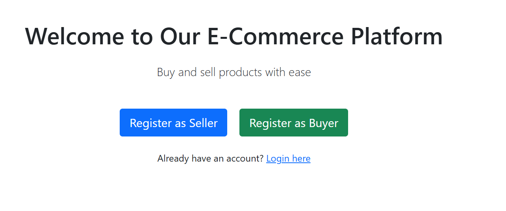
## * Seller Page
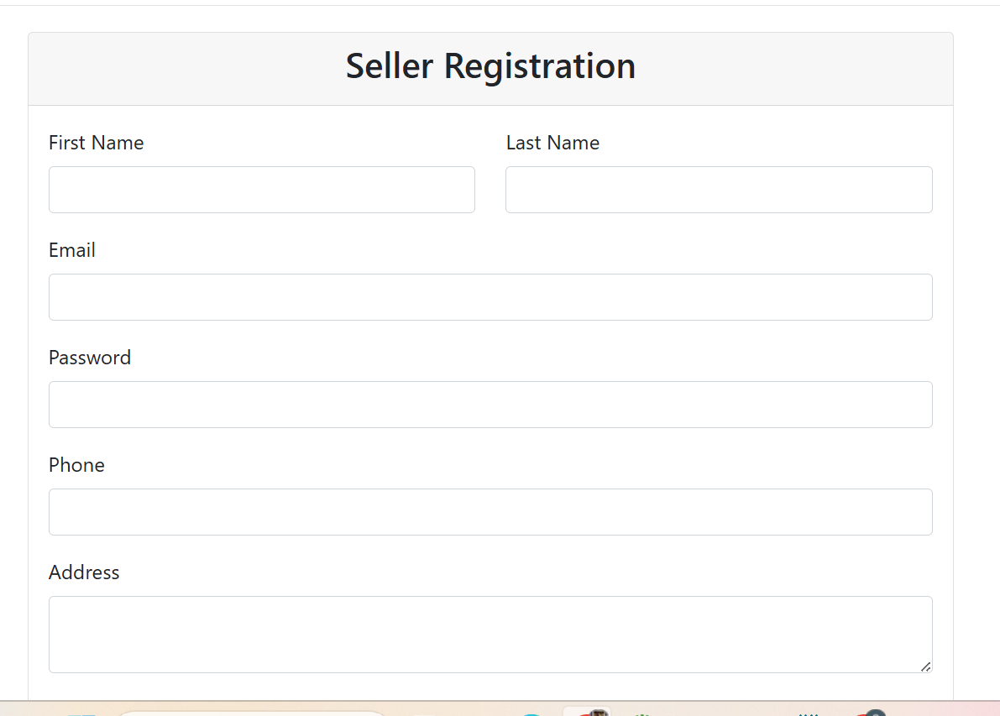
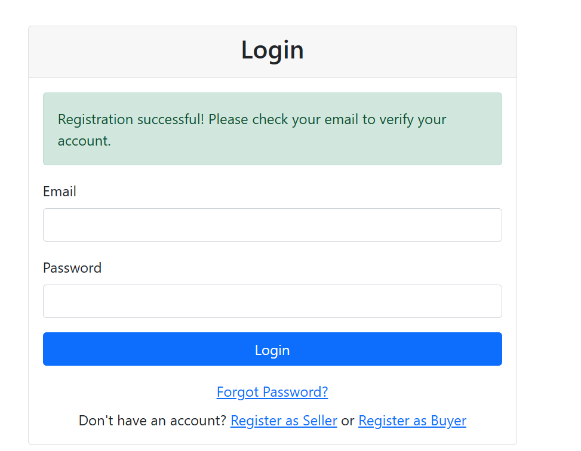
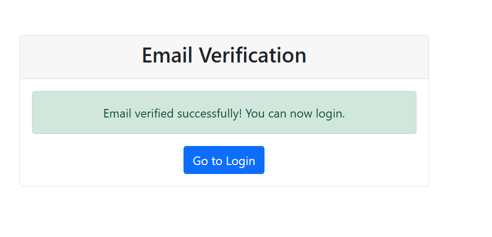
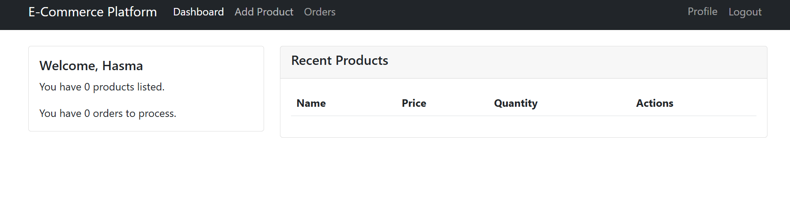
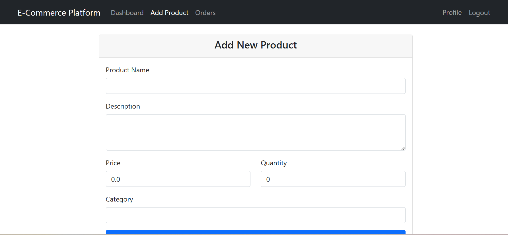
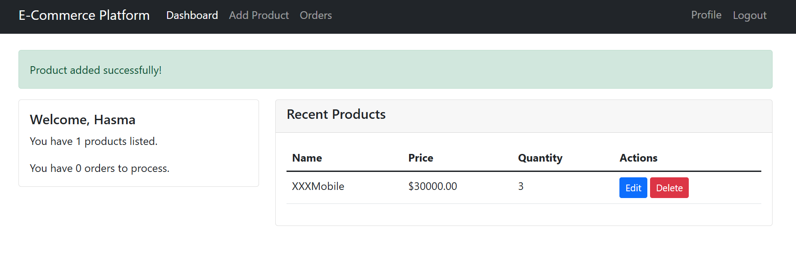
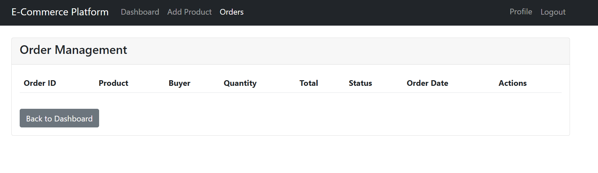
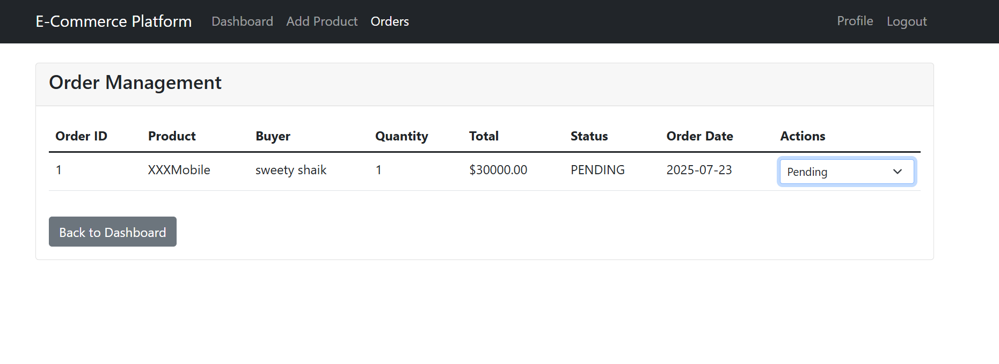
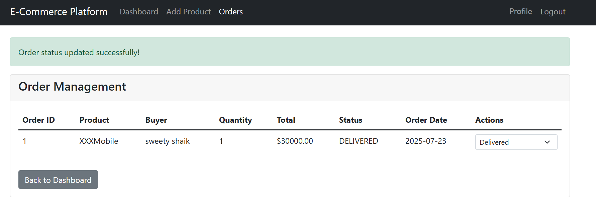

## * Buyer Page
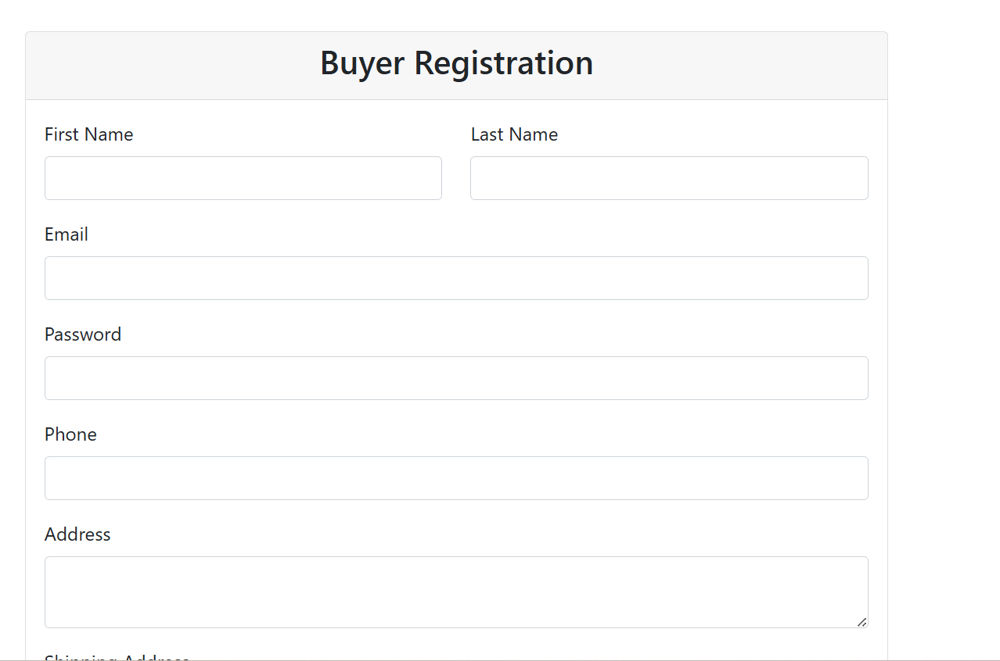
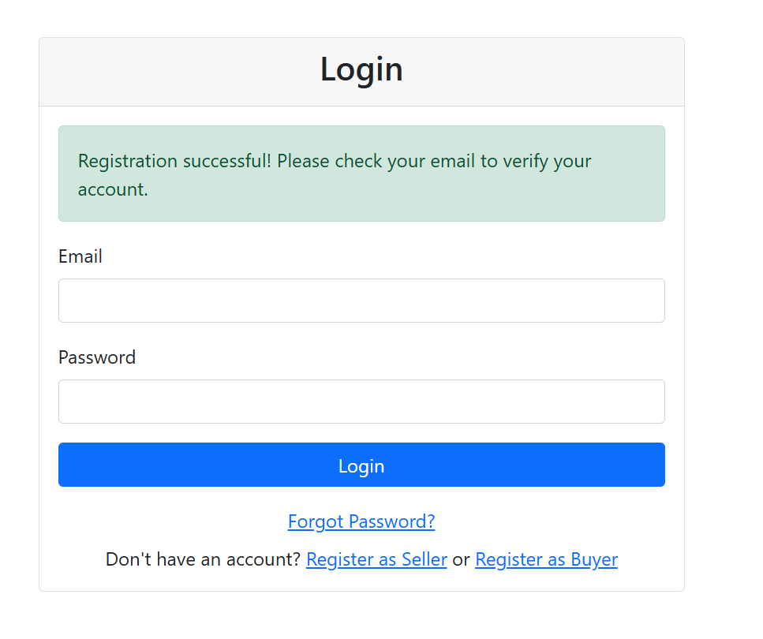
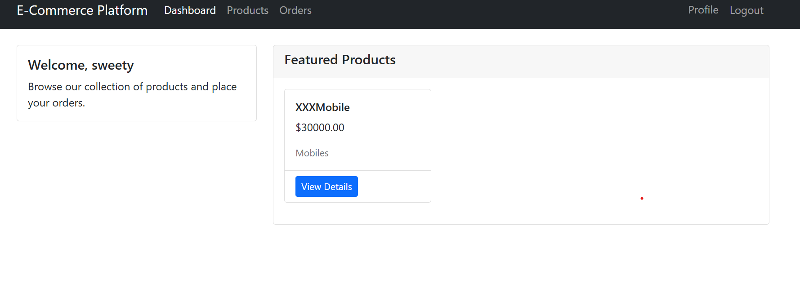
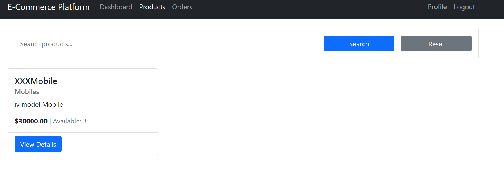
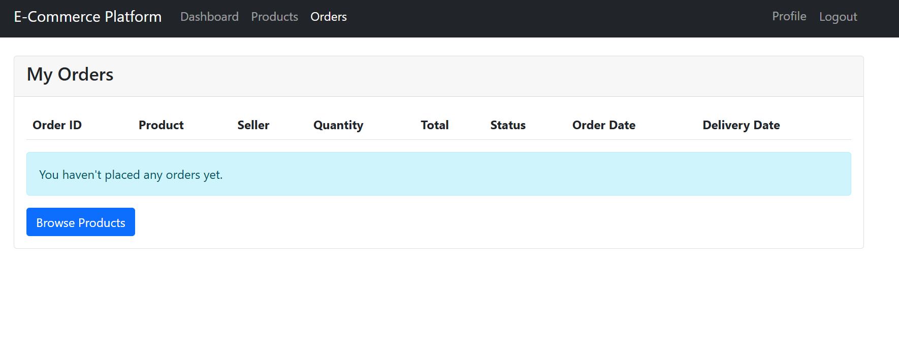
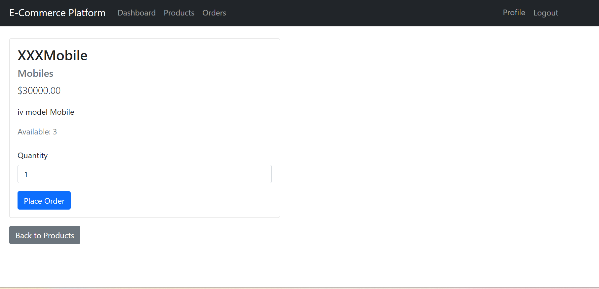
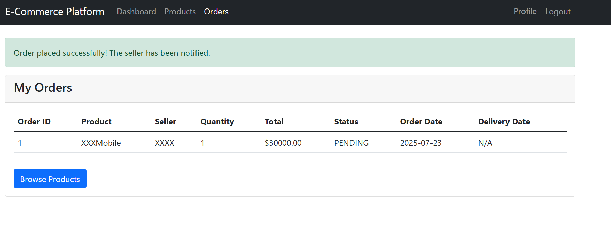
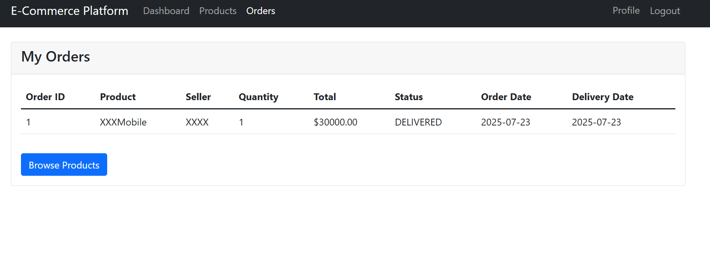

---

## 🚀 Features

- Seller and Buyer registration
- Secure Login functionality
- Password Reset & Email Verification
- Clean, responsive UI using Bootstrap

---

## 🛠️ Tech Stack

- **Backend:** Spring Boot, Spring MVC, Spring Security  
- **Frontend:** HTML5, CSS3, Bootstrap 5  
- **Database:** MySQL (or any JDBC-compatible DB)

---

## 🧪 How to Run

http:localhost:8080/

